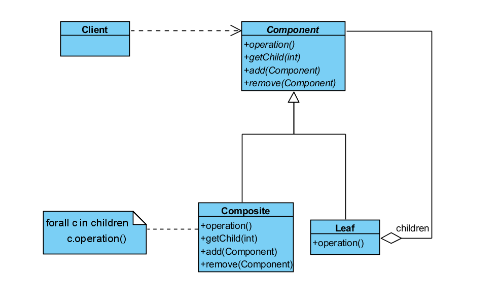
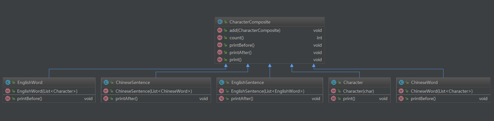

# 组合模式 ( Composite )

## 用途

将对象组合成树形结构以表示 “部分——整体” 的层次结构。 

Composite使得用户对单个对象和组合对象的使用具有一致性。

## 模式要点

### 组成部分
* Component : 是组合中的所有对象的统一接口；定义了特定情况下，类应当实现的货缺省的行为；Component 声明一个接口用于访问和管理 Component 的子组件；在递归结构中定义一个接口，用于访问一个父部件，并符合条件的类中实现它，当然这个是可选的。
* Leaf：在组合中表示叶节点对象，顾名思义，叶节点没有子节点。
* Composite：定义有子部件的那些部件的行为，同时存储子部件，实现 Component 中与子部件有关的接口。
* Client：通过Component接口，操纵组合部件的对象。
### 协作原理
* 用户使用Component类接口与组合结构中的对象进行交互。 如果接收者是一个叶节点，则直接处理请求。 如果接收者是Composite， 它通常将请求发送给它的子部件， 在转发请求之前与/或之后可能执行一些辅助操作。

## 实例分析
在中文中，一句话是由词语组成的，而词语又由字组成；在英文中，句子由单词组成，而单词又由一个个字母组成。每个对象都可定义的它之前的或之后的内容。比如一个中文句子总是以句号结尾，一个英文单词之前通常是有空格的。这种结构可以形成了递归嵌套的结构，句子是父容器，单词是子容器，字母是叶节点。

CharacterComposite 定义了所有容器类或叶节点的接口，容器应当实现的功能有：获取子组件、对子组件进行计数、添加子组件、删除子组件。Sentence(句子) 和 Word (单词)都属于容器，而 Character (字母)则属于叶节点，因为字母中无法再添加子组件了，它是层次结构中的最末端。

## 效果
* Composite 模式定义了基本对象和组合对象的基本层次结构，基本对象可以组合形成更复杂的对象，这个对象还可以再次进行组合，依次类推，可以实现无限层的递归嵌套结构，上文中提到的句子-单词-字母结构即是如此。
* 所有的容器都是这个接口的实现，用户可以一致地使用组合结构和单个对象，用户不需要知道它是否为叶节点或包含子容器的一个组件，从而大大简化了代码结构，定义组合的类时避免了各种复杂的包含着大量判断的方法。
* 在增加新的组件的时候更简单，无论是新增一种容器或一个叶节点都很方便，无需单独再定义新类并且可以很容易和现有的组件或容器结合工作，客户端无需随新组件的增加而做任何改变
* 使代码结构更具通用性，但也存在一些问题。增加组件很方便，但无法对子组件做过多的限制，即使客户希望在容器中只增加某种特定的组件，由于使用 Composite 而无法依靠别的类做过多的约束，这些检验类型的工作就要放到运行时去做了

## 适用场景
