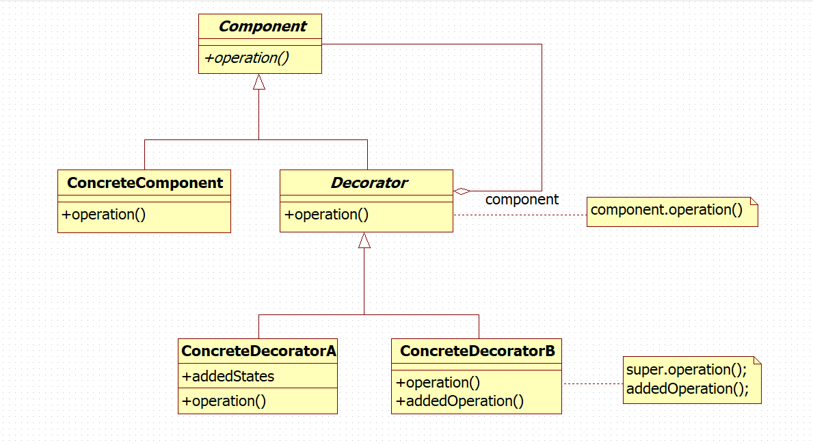
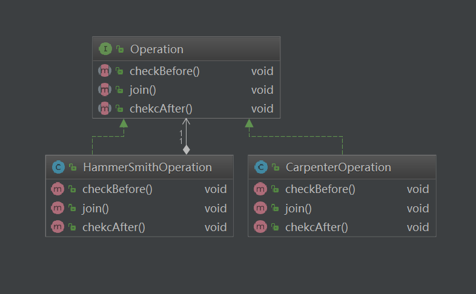

# 装饰模式 ( Decorator )

## 用途
用于动态地给一个对象添加一些额外的职责。 就增加功能来说， Decorator模式相比生成子类更为灵活。装饰模式以对客户端透明的方式扩展对象的功能，是继承关系的一个替代方案。

纯粹的装饰模式很难找到，大多数的装饰模式的实现都是“半透明”的，而不是完全透明的。换言之，允许装饰模式改变接口，增加新的方法。半透明的装饰模式是介于装饰模式和适配器模式之间的。适配器模式的用意是改变所考虑的类的接口，也可以通过改写一个或几个方法，或增加新的方法来增强或改变所考虑的类的功能。                                                                                     大多数的装饰模式实际上是半透明的装饰模式，这样的装饰模式也称做半装饰、半适配器模式。

## 适用场景

以下情况使用Decorator模式
* 在不影响其他对象的情况下， 以动态、 透明的方式给单个对象添加职责。
* 处理那些可以撤消的职责。
* 当不能采用生成子类的方法进行扩充时。 一种情况是， 可能有大量独立的扩展， 为支持每一种组合将产生大量的子类， 使得子类数目呈爆炸性增长。 另一种情况可能是因为类定义被隐藏， 或类定义不能用于生成子类。

## 模式要点



### 组成部分
* Component：定义一个对象接口， 可以给这些对象动态地添加职责。
* ConcreteComponent：定义一个对象， 可以给这个对象添加一些职责。
* Decorator：持有一个指向 Component 对象的引用，并定义一个与 Component 接口一致的接口。
* ConcreteDecorator：一向组件添加职责。

### 协作原理
* Decorator 将请求转发给它的 Component 对象， 并有可能在转发请求前后执行一些附加的动作。

## 实例分析


铁匠和木匠同时制作一把铁锤，第一种方案是木匠制作锤把，铁匠制作锤头；第二中方案是铁匠先制作锤把再制作锤头（假定这里的木匠只会制作锤把）。制作过程分为三部分：1.对材料进行初步的检查，2.进行制造并把部件安装起来以供后面的操作，3.完成之后再次进行检查，确保没有质量问题。

首先定义“操作”接口，包括前后两次检查以及安装的操作。

```
/**
 * 流水线上操作行为的接口
 */
public interface Operation {

  void checkBefore();

  void join();

  void chekcAfter();
}
```
现在只由木匠制作锤把，定义一个木匠的操作类 CarpenterOperation
```
/**
 * 木匠的工作
 */
public class CarpenterOperation implements Operation {

  private static final Logger LOGGER = LoggerFactory.getLogger(CarpenterOperation.class);

  @Override
  public void checkBefore() {
    LOGGER.info("检查木材");
  }

  @Override
  public void join() {
    LOGGER.info("打造锤把");
  }

  @Override
  public void chekcAfter() {
    LOGGER.info("检查成品锤把");
  }
}
```
由于某些原因，铁匠决定自己制作锤把，现在铁匠身兼双职，将木匠的工作也承担了。定义一个铁匠操作类 HammerSmith
```
/**
 * 铁匠
 */
public class HammerSmithOperation implements Operation {

  private static final Logger LOGGER = LoggerFactory.getLogger(HammerSmithOperation.class);
  private Operation previousOperation;

  public HammerSmithOperation(Operation previousOperation) {
    this.previousOperation = previousOperation;
  }

  @Override
  public void checkBefore() {
    previousOperation.checkBefore();
    LOGGER.info("检查铁材");
  }

  @Override
  public void join() {
    previousOperation.join();
    LOGGER.info("打造锤头");
  }

  @Override
  public void chekcAfter() {
    previousOperation.chekcAfter();
    LOGGER.info("检查成品锤头");
  }
}
```

同样实现了“操作”的接口，铁匠的每个操作都包含了木匠相应的操作，相当于对木匠的操作增加了一层包裹和扩展。这种包装就是 Decorator 模式中的装饰。

现在分别让木匠和铁匠进行一系列操作
```
/**
 * Decorator
 */
public class me.zbl.ovserver.Application {

  private static final Logger LOGGER = LoggerFactory.getLogger(me.zbl.ovserver.Application.class);

  public static void main(String[] args) {
    LOGGER.info("仅由木匠制作锤把");
    Operation carpenter = new CarpenterOperation();
    carpenter.checkBefore();
    carpenter.join();
    carpenter.chekcAfter();

    LOGGER.info("由铁匠完成锤把以及锤头的制作");
    Operation hammerSmith = new HammerSmithOperation(carpenter);
    hammerSmith.checkBefore();
    hammerSmith.join();
    hammerSmith.chekcAfter();
  }
}
```
输出如下内容
```
    仅由木匠制作锤把
    检查木材
    打造锤把
    检查成品锤把
    
    由铁匠完成锤把以及锤头的制作
    检查木材
    检查铁材
    打造锤把
    打造锤头
    检查成品锤把
    检查成品锤头
```

## 效果
### 优点
1. 装饰模式和静态继承的机制的作用都是对现有的类增加新的功能，但装饰模式有着比静态继承更灵活的组合方式。装饰模式可以在运行的时候决定需要增加还是去除一种“装饰”以及什么“装饰”。静态继承则没有这样的灵活性，它对类功能的扩展是在运行之前就确定了的。
2. 得益于装饰模式在组合上的灵活性和便利性，我们可以将各种装饰类进行组合，从而较为简单的创造各种不同的行为集合，实现多种多样的功能。
### 缺点
1. 装饰者的对象和它装饰的对象本质上是完全不同的，装饰模式会生成许多的对象，导致区分各种对象变得困难
2. 由于使用相同的标识，对于程序的理解和拍错过程的难度也会随之增加