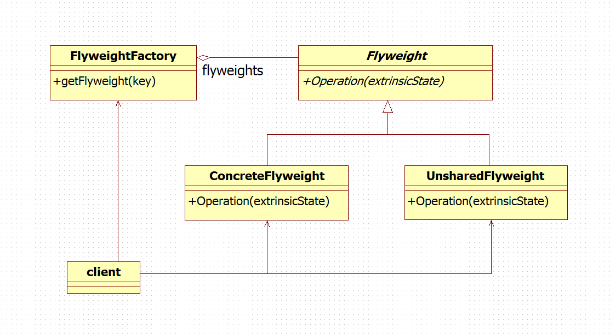
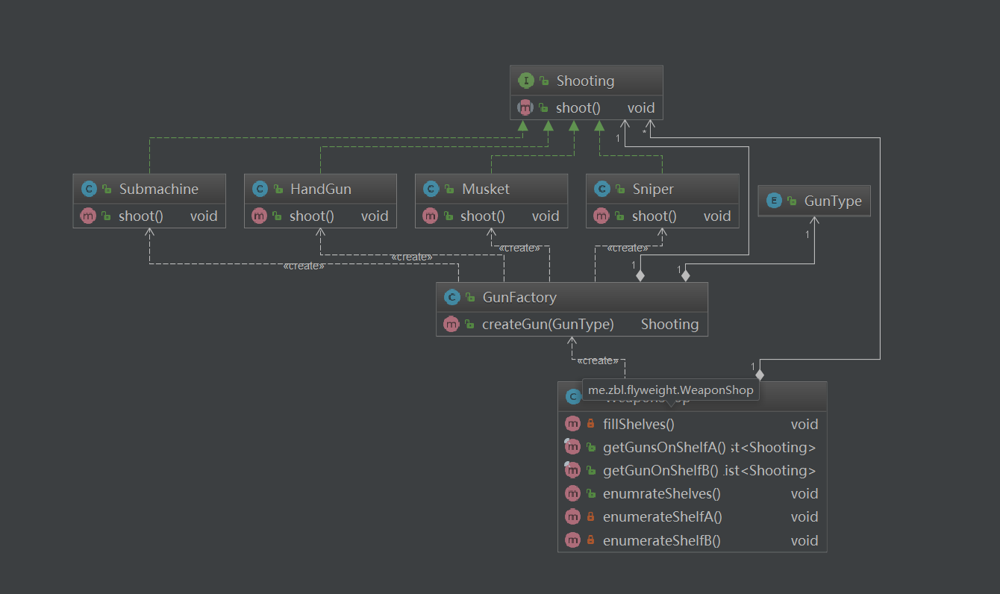

# 享元模式 ( Flyweight )

## 用途

运用共享技术有效地支持大量细粒度的对象。

## 适用场景

Flyweight模式的有效性很大程度上取决于如何使用它以及在何处使用它。 当以下情况都成立时使用flyweight模式：
* 一个应用程序使用了大量的对象。
* 完全由于使用大量的对象，造成很大的存储开销。
* 对象的大多数状态都可变为外部状态。
* 如果删除对象的外部状态，那么可以用相对较少的共享对象取代很多组对象。
* 应用程序不依赖于对象标识。由于Flyweight对象可以被共享，对于概念上明显有别的对象，标识测试将返回真值。

## 模式要点



### 组成部分

* Flyweight - 描述一个接口， 通过这个接口 flyweight 可以接受并作用于外部状态。
* ConcreteFlyweight — 实现 Flyweight 接口，并为内部状态（如果有的话）增加存储空间 。ConcreteFlyweight对象必须是可共享的。 它所存储的状态必须是内部的；即它必须独立于 ConcreteFlyweight 对象的场景。
* UnsharedConcreteFlyweight — 并非所有的 Flyweight 子类都需要被共享。Flyweight 接口使共享成为可能， 但它并不强制共享。 在 Flyweight 对象结构的某些层次，UnsharedConcreteFlyweight 对象通常将 ConcreteFlyweight 对象作为子节点。
* FlyweightFactory — 创建并管理 flyweight 对象。确保合理地共享 flyweight。当用户请求一个 flyweight 时，FlyweightFactory 对象提供一个已创建的实例或者创建一个（如果不存在的话)。
* Client：持有一个对 flyweight 的引用。计算或存储一个（多个）flyweight 的外部状态。

### 协作原理

* flyweight 执行时所需的状态必定是内部的或外部的。内部状态存储于 ConcreteFlyweight 对象之中；而外部对象则由 Client 对象存储或计算。当用户调用 flyweight 对象的操作时，将该状态传递给它。
* 用户不应直接对 ConcreteFlyweight 类进行实例化， 而只能从 FlyweightFactory 对象得到 ConcreteFlyweight 对象，这可以保证对它们适当地进行共享。

## 实例分析



出售武器的商店里摆满了各式的枪。许多枪的型号是一样的，所以不需要为每一个都创建新的对象。相反，一个对象实例可以表示多个货架项目，因此内存占用空间很小。

所有的枪都可以发出射击这个动作，因此定义一个枪的接口 Shooting
```
public interface Shooting {

  void shoot();
}
```

商店里的枪可以大致分为手枪、步枪、狙击枪和冲锋枪，分别定义四种枪类，它们都实现 Shooting 接口
```
/**
 * 手枪
 */
public class HandGun implements Shooting {

  private static final Logger LOGGER = LoggerFactory.getLogger(HandGun.class);

  @Override
  public void shoot() {
    LOGGER.info("手枪开火了(Hash={})", System.identityHashCode(this));
  }
}
```
```
/**
 * 步枪
 */
public class Musket implements Shooting {

  private static final Logger LOGGER = LoggerFactory.getLogger(Musket.class);

  @Override
  public void shoot() {
    LOGGER.info("步枪开火了(Hash={})", System.identityHashCode(this));
  }
}
```

```
/**
 * 狙击枪
 */
public class Sniper implements Shooting {

  private static final Logger LOGGER = LoggerFactory.getLogger(Sniper.class);

  @Override
  public void shoot() {
    LOGGER.info("狙击枪开火了(Hash={})", System.identityHashCode(this));
  }
}
```

```
/**
 * 冲锋枪
 */
public class Submachine implements Shooting {

  private static final Logger LOGGER = LoggerFactory.getLogger(Submachine.class);

  @Override
  public void shoot() {
    LOGGER.info("冲锋枪开火了(Hash={})", System.identityHashCode(this));
  }
}
```

武器的生成由武器工厂类完成，同一种枪只存在一个对象
```
/**
 * 武器工厂
 */
public class GunFactory {

  private Map<GunType, Shooting> gunRepo;

  public GunFactory() {
    gunRepo = new EnumMap<GunType, Shooting>(GunType.class);
  }

  public Shooting createGun(GunType type) {
    Shooting gun = gunRepo.get(type);
    if (null == gun) {
      switch (type) {
        case HANDGUN: {
          gun = new HandGun();
          gunRepo.put(HANDGUN, gun);
          break;
        }
        case MUSKET: {
          gun = new Musket();
          gunRepo.put(MUSKET, gun);
          break;
        }
        case SNIPER: {
          gun = new Sniper();
          gunRepo.put(SNIPER, gun);
          break;
        }
        case SUBMACHINE: {
          gun = new Submachine();
          gunRepo.put(SUBMACHINE, gun);
          break;
        }
      }
    }
    return gun;
  }
}
```

武器商店使用武器工厂获得各种枪，放到两个不同的货架上
```
/**
 * 武器商店
 */
public class WeaponShop {

  private static final Logger LOGGER = LoggerFactory.getLogger(WeaponShop.class);

  private List<Shooting> shelfA;
  private List<Shooting> shelfB;

  public WeaponShop() {
    shelfA = new ArrayList<>();
    shelfB = new ArrayList<>();
    fillShelves();
  }

  private void fillShelves() {
    GunFactory factory = new GunFactory();

    shelfA.add(factory.createGun(HANDGUN));
    shelfA.add(factory.createGun(HANDGUN));
    shelfA.add(factory.createGun(MUSKET));
    shelfA.add(factory.createGun(MUSKET));
    shelfA.add(factory.createGun(SNIPER));
    shelfA.add(factory.createGun(SNIPER));
    shelfA.add(factory.createGun(MUSKET));
    shelfA.add(factory.createGun(HANDGUN));

    shelfB.add(factory.createGun(SUBMACHINE));
    shelfB.add(factory.createGun(SUBMACHINE));
    shelfB.add(factory.createGun(SUBMACHINE));
    shelfB.add(factory.createGun(SNIPER));
  }

  public final List<Shooting> getGunsOnShelfA() {
    return Collections.unmodifiableList(shelfA);
  }

  public final List<Shooting> getGunOnShelfB() {
    return Collections.unmodifiableList(shelfB);
  }

  public void enumrateShelves() {
    enumerateShelfA();
    enumerateShelfB();
  }

  private void enumerateShelfA() {
    LOGGER.info("从A货架上拿走所有武器");
    for (Shooting gun : shelfA) {
      gun.shoot();
    }
  }

  private void enumerateShelfB() {
    LOGGER.info("从B货架上拿走所有武器");
    for (Shooting gun : shelfB) {
      gun.shoot();
    }
  }
}
```

使用
```
    WeaponShop shop = new WeaponShop();
    shop.enumrateShelves();
```
## 效果

使用 Flyweight 模式时， 传输、 查找和/或计算外部状态都会产生运行时的开销， 尤其当 flyweight 原先被存储为内部状态时。然而，空间上的节省抵消了这些开销。共享的 flyweight 越多， 空间节省也就越大。

存储节约由以下几个因素决定：

* 因为共享，实例总数减少的数目
* 对象内部状态的平均数目
* 外部状态是计算的还是存储的共享的Flyweight越多，存储节约也就越多。节约量随着共享状态的增多而增大。当对象使用大量的内部及外部状态，并且外部状态是计算出来的而非存储的时候，节约量将达到最大。所以，可以用两种方法来节约存储：用共享减少内部状态的消耗，用计算时间换取对外部状态的存储。

Flyweight 模式经常和 Composite 模式结合起来表示一个层次式结构， 这一层次式结构是一个共享叶节点的图。 共享的结果是， Flyweight的叶节点不能存储指向父节点的指针。而父节点的指针将传给 Flyweight 作为它的外部状态的一部分。这对于该层次结构中对象之间相互通讯的方式将产生很大的影响。